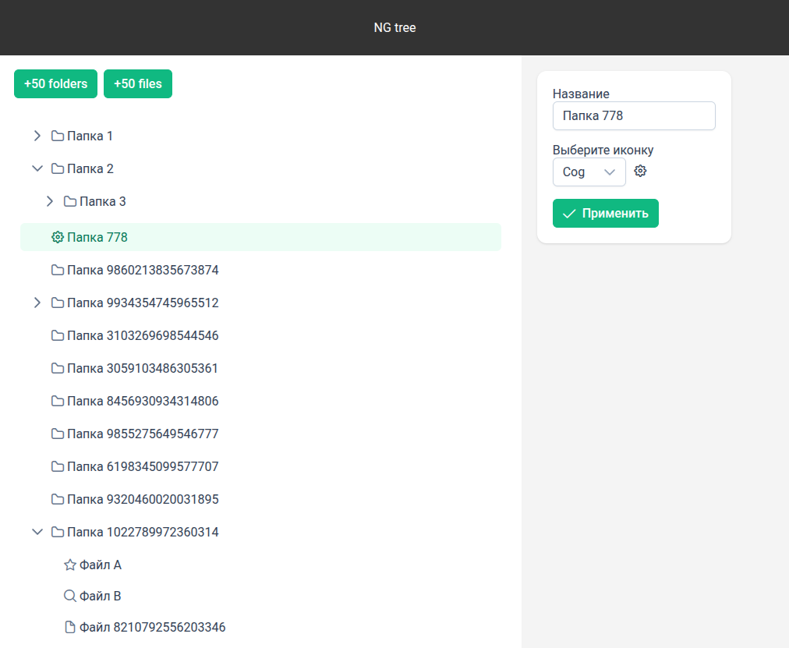

# NgTree

This project was generated using [Angular CLI](https://github.com/angular/angular-cli) version 19.1.7.

---

[Demo](https://venerable-wisp-c1220a.netlify.app/)

## **Overview**

This is a test task for an Angular application that manages a catalog structure with folders and items. The application consists of two main panels:

- A **left panel** displaying a hierarchical tree of folders and subfolders.
- A **right panel** serving as an editor for modifying folder and item properties.



## **Features**

### **1. Folder & Item Management**

- The left panel allows users to create folders and items.
- Two buttons are available:
    - **"Create 50 items"** – generates 50 items with random names in the selected folder.
    - **"Create 50 folders"** – generates 50 subfolders in the selected folder.

### **2. Drag & Drop Functionality**

- Users can **move** folders and items within the tree structure using drag-and-drop.
- **Ctrl key behavior**:
    - Holding the **Ctrl** key while dragging **copies** items instead of moving them.

### **3. Editor Panel**

- The right panel provides an interface to edit folder or item properties, allowing users to:
    - Change the **name** of a folder or item.
    - Update the **icon** of a folder or item.

## **Installation & Setup**

1. Clone the repository:
    ```sh
    git clone https://github.com/ctrl-break/ng-tree.git
    cd ng-tree
    ```
2. Install dependencies:
    ```sh
    npm install
    ```
3. Start the development server:
    ```sh
    npm start
    ```
4. Open the application in the browser:
    ```
    http://localhost:4200
    ```
